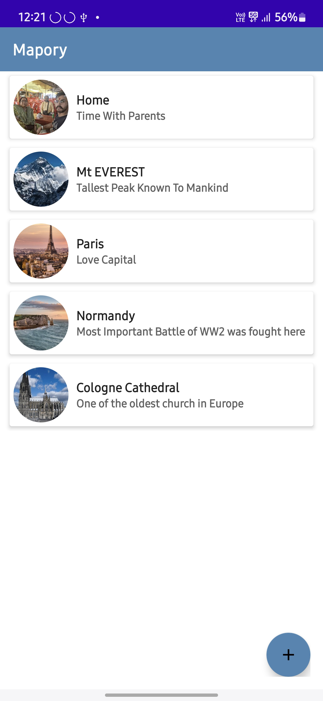
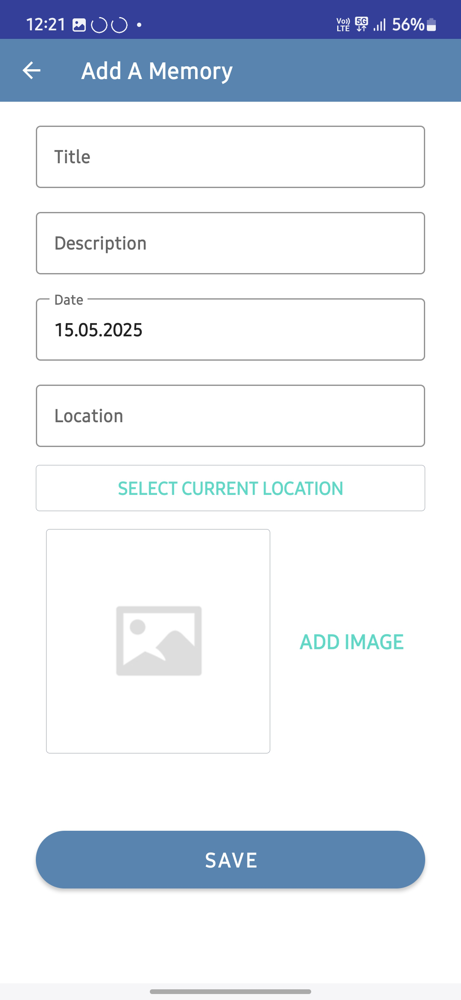
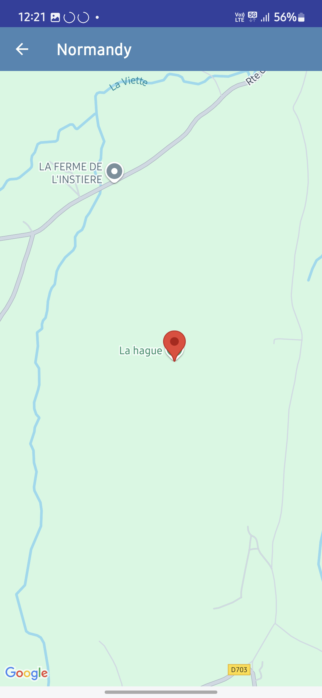
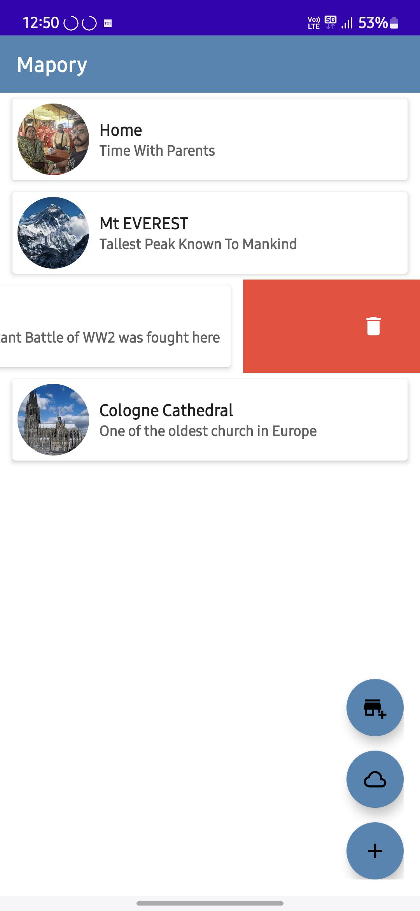
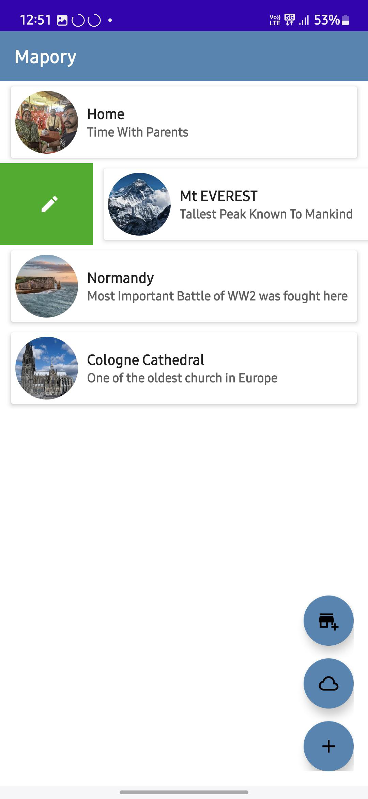

# 🗺️ Mapory – Your Travel Memory Companion

Mapory is an intuitive Android app that lets you **save and revisit memorable places** using Google Maps.  
Whether it's a hidden cafe, a scenic view, or a travel destination, Mapory helps you **remember and relive your adventures** with just a tap.

Just be aware in the next release there will be more features in this 

---

## 📸 Screenshots

<div align="center">
  
  
  
  
   
   
</div>

---

## 🎥 Demo

<div align="center">
  
</div>

---

## 🚀 Features

- 📍 Save locations with **custom names**
- 🗺️ View all saved places on an interactive **Google Map**
- 📝 Attach **personal notes** to each place
- 🧭 **Navigate** to saved locations via Google Maps
- ⚡ **Lightweight and fast** – designed for simplicity and speed

---

## 🛠️ Tech Stack

- **Language:** Kotlin  
- **Architecture:** MVVM  
- **UI:** XML, Material Components  
- **Database:** Room (SQLite)  
- **Maps:** Google Maps SDK  
- **Permissions:** Foreground Location Access

---

## 📥 Installation

Clone the repository and open it in **Android Studio**:

```bash
git clone https://github.com/NeelSaurikh/Mapory
